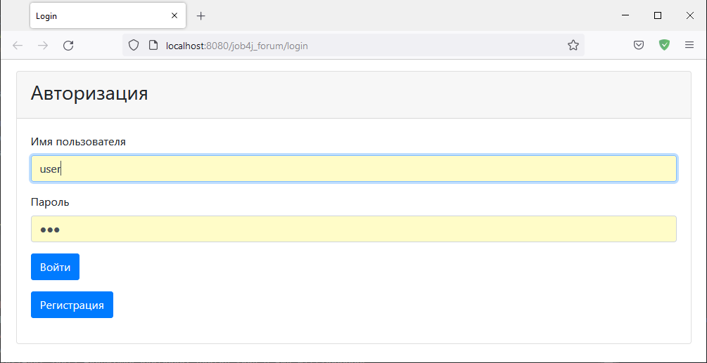
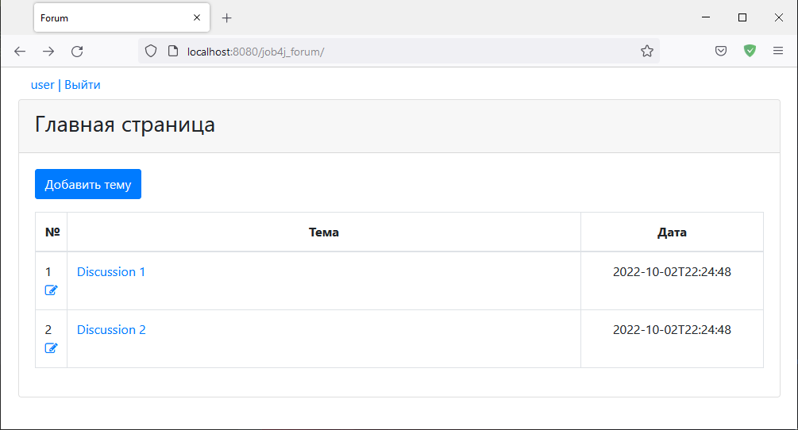
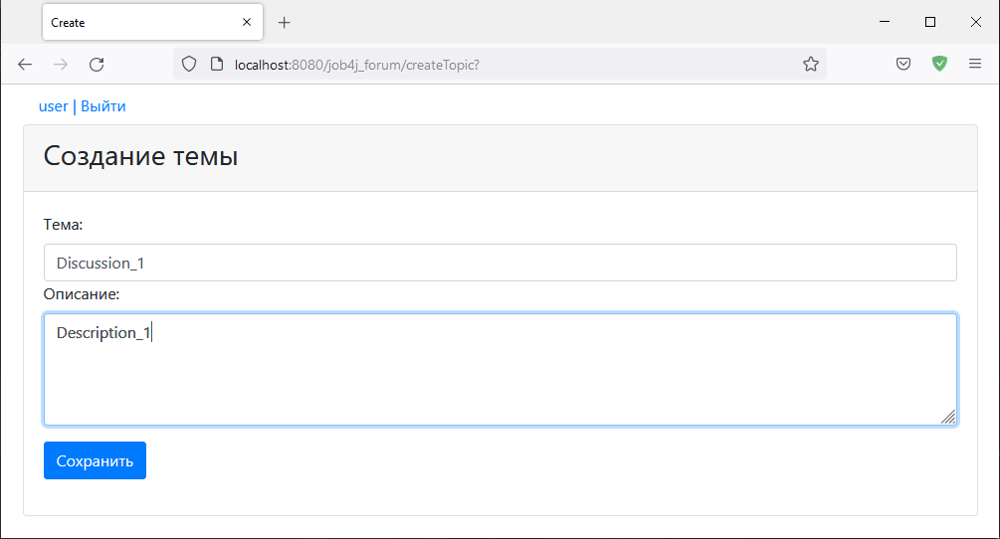
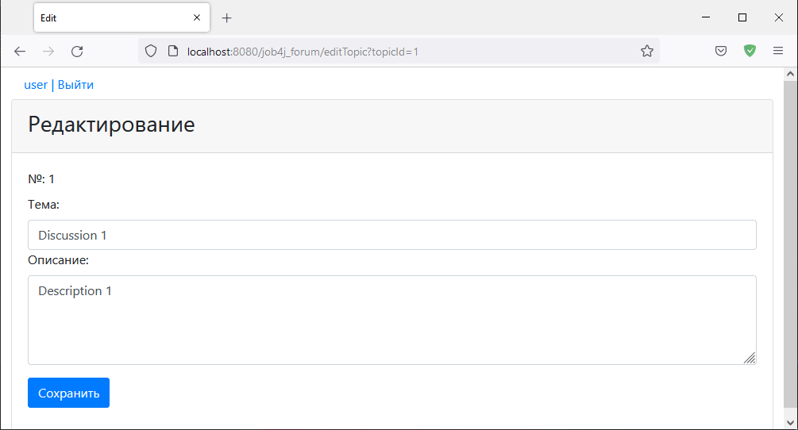
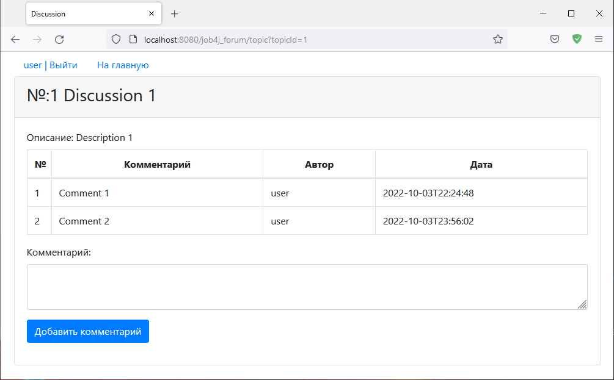

[](https://app.travis-ci.com/VadimShein/job4j_forum)

# <p align="center">Веб приложение Форум</p>

## Описание:
Пользователи создают темы для общения или присоединяются к существующим.
Добавление коментариев возможно после прохождения регистрации и авторизации.


## Используемые технологии:
* Java 11
* Spring Boot, Spring MVC, Spring Security
* Spring Data, PostgreSQL, H2, Hibernate, Liquibase
* HTML, Bootstrap, CSS, JSP, JSTL
* JUnit, Mockito, Maven, Heroku


## Ссылка на Heroku
[https://fierce-reaches-19602.herokuapp.com](https://fierce-reaches-19602.herokuapp.com/login)


## Скриншоты:
1. Авторизация пользователя


2. Главная страница. Список всех тем форума.


3. Страница создания темы


4. Страница Редактирования темы


5. Страница с выбраной темой и комментариями пользователей



## Запуск проекта:
1. Скопировать проект 
```
git clone https://github.com/VadimShein/job4j_forum
```

2. Создать базу данных forum и таблицы из файлов src/main/resources/db/

3. Выполнить сборку проекта 
```
mvn clean package -DskipTests
```

4. Запустить приложение, адрес по умолчанию  [http://localhost:8080/](http://localhost:8080/)
```
mvn spring-boot:run
```

## Контакты:
[](https://t.me/SheinVadim)
[](mailto:shein.v94@mail.ru)
